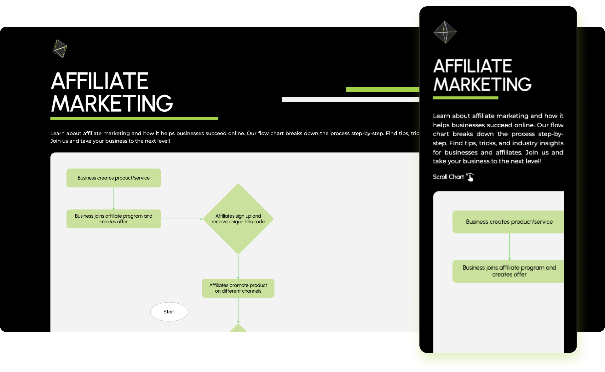
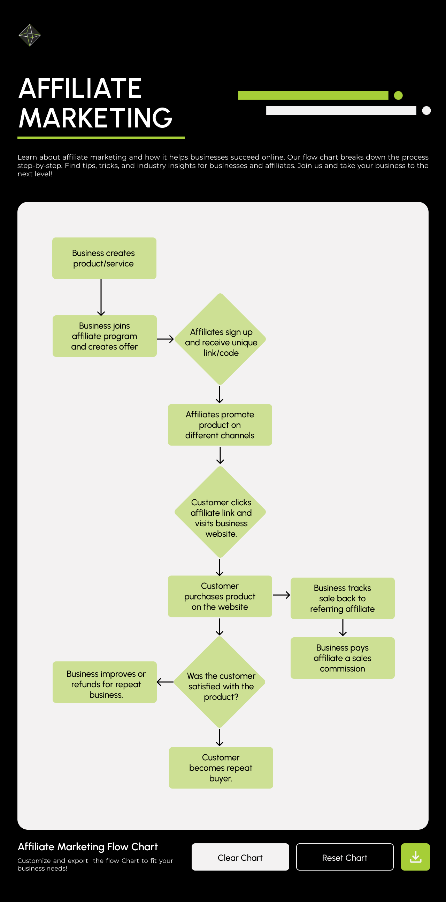

# Hanna Girma's Test Task For Mine Marketing

Hello, This is my submission for the test task. You can run the code as instructed below or see this deployed version  [Mine Flow](https://mine-flow.vercel.app/).

** Note: I designed the page to be similar with the mine marketing offical website. The inspiration for the page also came from the case study found on the website. **




## How to Run


### First clone this repository

```
git clone https://github.com/HannaGirmaYas/mine-flow.git

```

### Install the packages

After cloning the repository, In the project directory, run 

```
npm install

```
to install all the packages

### Run the Project

Finally run 
```
npm start

```

### The Project

I decided on making a flow chart that explains how affiliate marketing works , and this flow chart can be edited by the users so they can add or remove content that aligns with how they will use affiliate marketing. The user can clear the chart , reset the chart to the initial state and download the chart.

### What I used

`flowchart-react` : I used the package specified in the task to make the flowchart
`@reduxjs/toolkit` : I used redux and redux toolkit for state managment
`redux-persist`: I used redux persist to persist the data in local storage
`tailwind` : I used tailwind css to style the page
`@mui/material`: I used material ui to build the edit a node in the flow chart
`@mui/icons-material`: I used material icons to add icons to the page
`gsap`: I used gsap to animate the flowchart

### Steps I took 

- I first looked at the flowchart package and checked how much customization I could do

- I then designed the page in figma to lay out what I wanted to do. The figma design is as seen below.


- I started implementing the page with react templated with typescript. 

- When working with the flowchart package I started with the example code and I expanded on that by first setting up the state managment. I created a chart slice where I defined the charts inital state and the states and actions. I defined four actions updateNodes, updateConnections, clearChart and resetChart. I then created my store and added the reducer here. I then updated the index file to include the provider in which I passed the store.
- I used useSelector and dispatch to access the store data and update it. I then installed react persist. I set up my persistor in my store and the updated the index page accordingly. 
- Asides from the example code, I added an option to edit the new nodes text. I used the onDoubleClick event to create a node and a onNodeDoubleClick event to edit the node. I used material ui to add a dialog where you can input the title to a node.
- I then started to implement my design accordingly. I split up the page into four components. The header, The chart , The controls and The footer.  I implemented the ui with tailwind according to my design and used the google font I used. 

- When implementing the chart, I wanted more control over the styling so I inspected the page to find selectors where I can target the nodes. I then wrote some custom css code for the the nodes. I also wrote a scroll triggered animation code for the nodes with gsap. 

- Finally , I made the page responsive with the use of tailwind.

### Persisting The Data

I initially persisited the data to local storage with the use of redux-persist but one of the hints that was given to me was to use useEffect to save the data on local storage. So, I have a branch called useEffect that implements the persisting of the data with the use of useEffect.


